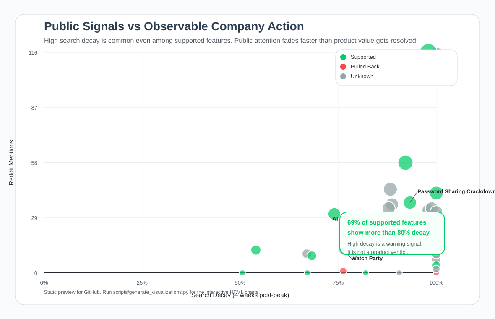
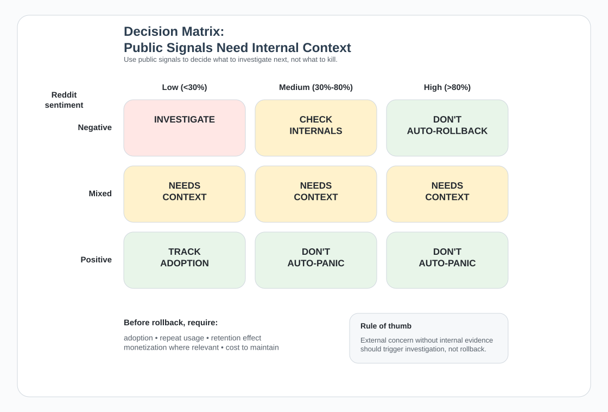

# Public Signals Mislead

Netflix's password sharing crackdown lost 93% of its search interest within four weeks of peak — and added 9.3M paid subscribers the same quarter. If you had used public signals to recommend a rollback, you would have killed one of Netflix's most successful product decisions of the decade.

This repo studies that gap. Across 36 subscription features, 69% of the ones companies kept backing still show more than 80% search decay. Public attention resolves much faster than product value does, and external signals like Google Trends or Reddit reaction are weak standalone inputs for product decisions — especially when the internal metrics that matter most are invisible from the outside.

The repo separates two ideas that should not be mixed:

- `company_action`: what the public record shows the company did
- `business_outcome`: what the public record can actually prove about value

Removal is observable. True value often is not. That distinction is the backbone of the analysis.

The repo is written as a decision-support case study, not a model demo. The work is organized around three questions:

- what can we actually observe from the outside
- what remains unknown without internal product data
- where teams are most likely to overread noisy public signals

## The Product Question

A feature launches. Search interest drops a month later. Reddit gets loud. The tempting story is:

- decay means the feature is fading
- backlash means the feature is failing
- rollback is the safe move

This repo pushes back on that shortcut.

What the public record usually can show:

- search decay
- Reddit mention volume
- Reddit sentiment
- whether the company appears to keep backing the feature or pull back from it

What the public record usually cannot show:

- retention lift
- revenue contribution
- value to a niche but important audience
- internal strategy tradeoffs
- the counterfactual of what would have happened if the team made a different choice

That gap matters. Removal is observable. True value often is not.

## Main Finding

I analyzed 36 subscription features. Public decision context exists for 20 of them, and 19 have a usable `company_action` label for a simple supported-vs-pulled-back comparison.

Headline result:

- Supported features average `83.7%` search decay
- Pulled-back features average `92.1%` search decay
- Primary p-value is `0.284` with Mann-Whitney U
- `69%` of supported features still show more than `80%` decay (95% CI: 44%–86%, n=16)

The strongest interpretation is not "decay means nothing." It is narrower:

- heavy decay is common even when a company keeps backing the feature
- public attention resolves much faster than product value does
- a decaying trend line is not a product verdict

## What The Labels Mean

The repo now separates two ideas that should not be mixed.

- `company_action`
  - `SUPPORTED`: the public record suggests the company kept, expanded, or kept backing the feature
  - `PULLED_BACK`: the public record suggests the company removed it, undercut it, or clearly stopped backing it
  - `UNKNOWN`: the public story is too thin to classify honestly
- `business_outcome`
  - `POSITIVE` / `NEGATIVE` only when the public record includes real business evidence
  - `UNKNOWN` otherwise

This is the core design choice in the repo. `company_action` is often visible from outside. `business_outcome` usually is not.

Examples:

- `Netflix Password Sharing`: `company_action = SUPPORTED`, `business_outcome = POSITIVE`
- `Disney+ GroupWatch`: `company_action = PULLED_BACK`, `business_outcome = UNKNOWN`
- `Hulu Watch Party`: kept in the dataset, but both fields stay `UNKNOWN` because the public commentary is too soft to classify honestly

That last case is intentional. A product team may be tempted to read public commentary as truth. This repo treats that temptation as part of the problem, not as ground truth.

## Key Numbers

| Metric | Supported (n=16) | Pulled Back (n=3) | Primary p-value | Effect size |
|--------|------------------|-------------------|-----------------|-------------|
| Search decay | 83.7% ± 16.4% | 92.1% ± 13.7% | 0.284 | d = -0.52 |
| Reddit mentions | 30.8 ± 35.8 | 4.3 ± 6.7 | 0.144 | d = 0.78 |
| Negative sentiment | 10.0% ± 9.3% | 13.9% ± 24.1% | 0.774 | d = -0.33 |

Primary p-values use Mann-Whitney U because the pulled-back group is small.

Context coverage:

- 20 features with public decision context
- 19 features with an action label usable in the main comparison
- 9 features with a known business outcome
- 11 context-rich features where business outcome is still unknown

The sample is small, so the repo makes a cautious claim: public signals do not separate supported from pulled-back features cleanly enough to be trusted on their own.

### Sentiment Methodology

Reddit sentiment is computed by lexicon matching against 30 hand-picked positive and negative keywords. This is a deliberately crude method. A noisy measurement of an already-noisy signal reinforces the thesis: if sentiment computed this way still fails to distinguish supported from pulled-back features, a more sophisticated method is unlikely to rescue the signal. The lexicon is inspectable and swappable in `src/data_collection/reddit/reddit_validator.py`.

## Why The Finding Is Counter-Intuitive

The usual instinct is simple:

- decay dropped, so the feature is dying
- people complained, so the feature was a mistake

The dataset keeps breaking that story.

`Netflix Password Sharing`:

- `93%` search decay
- still clearly supported
- known positive business outcome

`Disney+ GroupWatch`:

- `100%` search decay
- pulled back later
- true audience value still unknown

Same broad public-signal pattern. Different product path. That is the repo's central tension.

## What You See On GitHub

The interactive charts are generated locally, but the repo includes two static previews so the main idea is visible immediately on GitHub. The first preview deliberately simplifies the full bubble chart so the overlap is readable in a static README.

### Main Signal View



What to notice:

- the supported features cluster heavily in the high-decay region too
- public-signal patterns overlap much more than the simple "decay means failure" story suggests

### Decision Framework Preview



What to notice:

- steep decay or loud backlash should trigger investigation
- rollback needs internal evidence, not just external concern

## How A Product Team Should Use This

This repo is not a rollback recommendation engine. It is a decision-quality check.

The intended use is:

1. Notice a worrying external signal like steep search decay or loud backlash.
2. Use the analysis to challenge the instinct to jump straight from "public concern" to "product verdict."
3. Pull the internal metrics that actually matter before recommending a rollback.
4. Treat public signals as prompts for investigation, not as proof.

If you want the product-facing version, start with:

- [Netflix password sharing case study](NETFLIX_CASE_STUDY.md) — the single best example of when public signals mislead
- [How a product team should use this repo](documentation/HOW_PRODUCT_TEAMS_SHOULD_USE_THIS.md)
- [What internal data I would require before recommending rollback](documentation/INTERNAL_DATA_FOR_ROLLBACK.md)
- [One-page decision framework](documentation/DECISION_FRAMEWORK_ONE_PAGER.md)
- [Architecture overview](documentation/ARCHITECTURE.md)

That is the real contribution here. I am not proving that teams made bad decisions. I am showing why public signals are not enough to justify one.

## What Internal Data I Would Require Before Recommending Rollback

This repo makes one practical point very clearly: external signals are not enough.

Before I would recommend rolling back a feature, I would want internal evidence on:

- adoption by eligible users
- repeat usage and habit formation
- retention impact for exposed vs unexposed users
- monetization or plan-upgrade contribution where relevant
- value for a niche but strategically important audience
- implementation cost, maintenance burden, and roadmap tradeoffs

Without that context, "people stopped searching for it" is too weak to be a decision rule.

## Quick Start

Create the local environment from the repo root:

```bash
python3 -m venv venv
source venv/bin/activate
python -m pip install -e .

# Optional: install test dependencies too
python -m pip install -e '.[dev]'

python scripts/apply_outcomes.py
python src/analysis/statistical_analysis.py
python scripts/generate_visualizations.py
```

Or run the one-command script:

```bash
./run_analysis.sh
```

If the repo was moved or renamed after `venv` was created, rebuild it:

```bash
./scripts/rebuild_venv.sh
```

## Visualizations

The repo generates five interactive HTML charts:

1. `decay_vs_action.html` - public signals vs observable company action
2. `divergence_examples.html` - case studies where similar signals lead to different product stories
3. `decision_matrix.html` - how to use noisy public signals without treating them as verdicts
4. `action_by_type.html` - observed support rate by feature type
5. `action_signal_comparison.html` - signal averages for supported vs pulled-back features

> Interactive charts are generated locally. Run `python scripts/generate_visualizations.py`, then open `results/figures/decay_vs_action.html` in a browser.

## Project Structure

```text
public-signals-mislead/
├── config/                     # Public decision context + feature typing
├── documentation/             # Product-facing memo and decision artifacts
├── notebooks/                 # Lightweight walkthrough for repo readers
├── src/
│   ├── analysis/              # Statistical comparisons and sensitivity checks
│   ├── data_collection/       # Google Trends + Reddit collection pipeline
│   └── visualization/         # Plotly chart generation
├── tests/                     # Focused tests for the analysis layer
├── data/
│   ├── trends/                # Collected Google Trends outputs
│   └── validation/            # Labeled dataset + analysis exports
├── results/figures/           # Regenerated locally, not tracked in git
└── pyproject.toml             # Package metadata and test config
```

## What This Repo Does Not Claim

It does **not** prove that every pulled-back feature was a mistake.

It does **not** prove that every supported feature created business value.

It does **not** prove that teams actually used Google Trends or Reddit as their decision rule.

It does show that:

- public signals are weak standalone decision inputs
- company action is easier to observe than true value
- soft public commentary should not be treated as outcome proof
- teams need internal adoption, retention, and revenue context before turning outside noise into a product verdict

## Why It Matters

For product teams:

- do not auto-roll back a feature just because buzz collapsed
- do not confuse complaint volume with decision certainty
- use public signals to trigger questions, not to end the conversation

For data teams:

- separate what is observable from what is inferred
- avoid treating unknown business value as hidden certainty
- be explicit when the sample only supports a cautious conclusion

For hiring managers:

- this repo shows judgment, not just tooling
- the interesting part is not the test statistic alone
- the interesting part is drawing a hard boundary around what the public record can and cannot support

## Contact

Tomasz Solis
- Email: tomasz.solis@gmail.com
- [LinkedIn](linkedin.com/in/tomaszsolis)
- [GitHub](github.com/tomasz-solis)

## License

MIT
