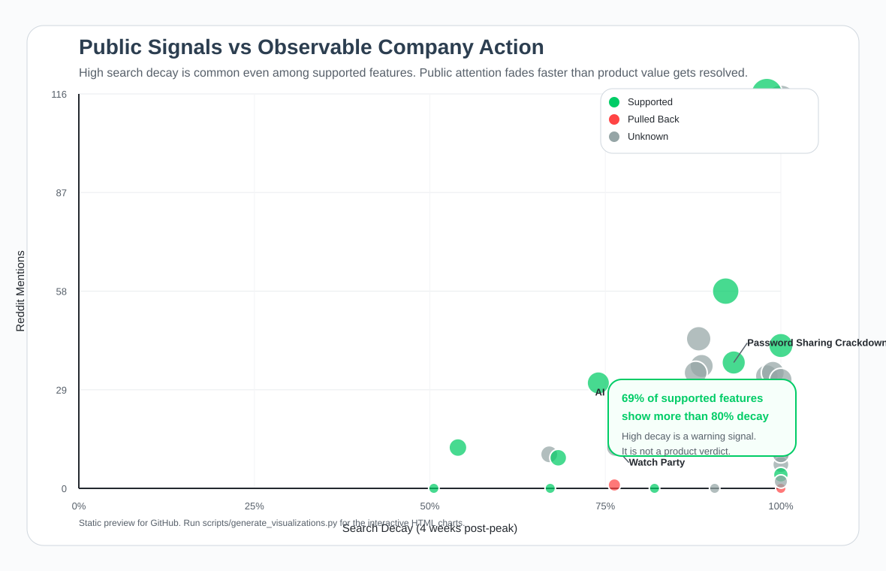
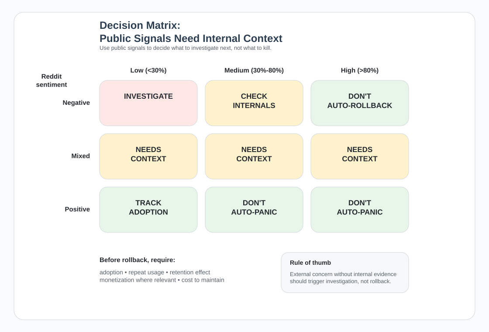

# Public Signals Mislead

Netflix's password-sharing crackdown lost 93% of its search interest within four weeks of peak, and added 9.3M paid subscribers in the same quarter. Reading the public signal would have pointed the wrong way.

Across 36 subscription features, 69% of the ones companies kept backing still show more than 80% search decay. Public attention fades much faster than product value. Google Trends and Reddit reaction are good prompts to investigate, but weak inputs for product decisions on their own when adoption, retention and revenue are hidden.

## The question

A feature launches. A month later search interest drops and Reddit gets loud. The tempting story: decay means the feature is fading, backlash means it's failing, so roll it back. This repo tests that shortcut.

| The public record can usually show | It usually can't show |
|---|---|
| Search decay | Retention lift |
| Reddit mention volume and sentiment | Revenue contribution |
| Whether the company kept backing the feature or pulled back | Value to a small but important audience |
| | Internal strategy tradeoffs |
| | What would have happened after a different choice |

Removal is observable. True value often isn't. That distinction runs through the whole analysis.

## Main finding

36 subscription features. 20 have public decision context, and 19 have a usable `company_action` label for a supported vs pulled-back comparison.

- Supported features average `83.7%` search decay.
- Pulled-back features average `92.1%`.
- Mann-Whitney U p-value: `0.284`.
- `69%` of supported features still show more than `80%` decay (95% CI 44% to 86%, n=16).

The claim is narrow. Heavy decay is common even when a company keeps backing a feature, and a falling trend line is not a product verdict.

## What the labels mean

Two fields that must not be mixed:

| Field | Value | Meaning |
|---|---|---|
| `company_action` | `SUPPORTED` | The public record suggests the company kept, expanded or kept backing the feature |
| | `PULLED_BACK` | The company removed it, undercut it or clearly stopped backing it |
| | `UNKNOWN` | The public story is too thin to classify honestly |
| `business_outcome` | `POSITIVE` / `NEGATIVE` | Only when the public record has real business evidence |
| | `UNKNOWN` | Everything else |

`company_action` is often visible from outside. `business_outcome` usually isn't.

Examples:

- Netflix Password Sharing: `company_action = SUPPORTED`, `business_outcome = POSITIVE`.
- Disney+ GroupWatch: `company_action = PULLED_BACK`, `business_outcome = UNKNOWN`.
- Hulu Watch Party: in the dataset, but both fields stay `UNKNOWN` because the public commentary is too soft to classify.

The Hulu case is deliberate. Reading public commentary as truth is part of the problem, so it isn't used as ground truth.

## Key numbers

| Metric | Supported (n=16) | Pulled back (n=3) | Mann-Whitney p | Effect size |
|--------|------------------|-------------------|----------------|-------------|
| Search decay | 83.7% ± 16.4% | 92.1% ± 13.7% | 0.284 | d = -0.52 |
| Reddit mentions | 30.8 ± 35.8 | 4.3 ± 6.7 | 0.144 | d = 0.78 |
| Negative sentiment | 10.0% ± 9.3% | 13.9% ± 24.1% | 0.774 | d = -0.33 |

The p-values use Mann-Whitney U because the pulled-back group is small.

Coverage: 20 features with public decision context, 19 with an action label for the main comparison, 9 with a known business outcome, and 11 with rich context but an unknown outcome.

The sample is small, so the claim is cautious: public signals don't separate supported from pulled-back features well enough to trust on their own.

### Sentiment method

Reddit sentiment matches against 30 hand-picked positive and negative keywords. That is crude on purpose. If a noisy measure of an already noisy signal still can't tell supported from pulled-back features, a fancier method is unlikely to rescue it. The lexicon is in `src/data_collection/reddit/reddit_validator.py` and easy to swap.

## Why it's easy to misread

Same public-signal pattern, different product path:

| Feature | Search decay | What happened | Business outcome |
|---|---|---|---|
| Netflix Password Sharing | 93% | Clearly supported | Known positive |
| Disney+ GroupWatch | 100% | Pulled back later | Unknown |

## Previews

The interactive charts are generated locally, so the repo includes two static previews. The first simplifies the full bubble chart so the overlap is readable.



Supported features cluster in the high-decay region too. The patterns overlap far more than "decay means failure" suggests.



Steep decay or loud backlash should trigger investigation. A rollback needs internal evidence.

## How to use it

This isn't a rollback recommendation engine. It's a check on decision quality.

1. Notice a worrying outside signal, such as steep search decay or loud backlash.
2. Use this analysis to challenge the jump from "public concern" to "product verdict".
3. Pull the internal metrics that matter before recommending a rollback.

Before recommending a rollback, I'd want internal evidence on:

- Adoption by eligible users.
- Repeat usage and habit.
- Retention for exposed vs unexposed users.
- Monetisation or plan upgrades, where relevant.
- Value for a small but strategically important audience.
- Build cost, maintenance and roadmap tradeoffs.

Without that, "people stopped searching for it" is too weak to be a decision rule.

Product-facing docs:

- [Netflix password sharing case study](NETFLIX_CASE_STUDY.md): the clearest example of public signals misleading.
- [How a product team should use this repo](documentation/HOW_PRODUCT_TEAMS_SHOULD_USE_THIS.md)
- [Internal data I'd need before recommending a rollback](documentation/INTERNAL_DATA_FOR_ROLLBACK.md)
- [One-page decision framework](documentation/DECISION_FRAMEWORK_ONE_PAGER.md)
- [Architecture](documentation/ARCHITECTURE.md)

## Quick start

From the repo root:

```bash
python3 -m venv venv
source venv/bin/activate
python -m pip install -e .
python -m pip install -e '.[dev]'   # optional, for tests

python scripts/apply_outcomes.py
python src/analysis/statistical_analysis.py
python scripts/generate_visualizations.py
```

Or run everything with `./run_analysis.sh`.

If you moved or renamed the repo after creating `venv`, delete `venv` and repeat the setup.

## Charts

`python scripts/generate_visualizations.py` writes five interactive HTML charts to `results/figures/`:

| File | Shows |
|---|---|
| `decay_vs_action.html` | Public signals vs observable company action |
| `divergence_examples.html` | Cases where similar signals led to different product stories |
| `decision_matrix.html` | How to use noisy public signals without treating them as verdicts |
| `action_by_type.html` | Support rate by feature type |
| `action_signal_comparison.html` | Signal averages for supported vs pulled-back features |

## Project structure

```text
public-signals-mislead/
├── config/                     # Public decision context + feature typing
├── documentation/              # Product-facing memo and decision docs
├── notebooks/                  # Short walkthrough for readers
├── src/
│   ├── analysis/               # Statistical comparisons and sensitivity checks
│   ├── data_collection/        # Google Trends + Reddit collection pipeline
│   └── visualization/          # Plotly charts
├── tests/                      # Tests for the analysis layer
├── data/
│   ├── trends/                 # Collected Google Trends outputs
│   └── validation/             # Labelled dataset + analysis exports
├── results/figures/            # Generated locally, not tracked
└── pyproject.toml              # Package metadata and test config
```

## What this repo doesn't claim

It doesn't prove every pulled-back feature was a mistake, that every supported feature created value, or that teams actually used Google Trends or Reddit to decide.

It does show that public signals are weak inputs on their own, that company action is easier to see than true value, that soft public commentary isn't proof of an outcome, and that teams need internal adoption, retention and revenue data before turning outside noise into a product verdict.

## What it means in practice

For product teams: don't roll back a feature just because the buzz collapsed, don't mistake complaint volume for certainty, and use public signals to start questions, not end them.

For data teams: keep what you observed apart from what you inferred, don't treat unknown business value as a hidden certainty, and say so when the sample only supports a cautious conclusion.

## Contact

Tomasz Solis · tomasz.solis@gmail.com · [LinkedIn](https://www.linkedin.com/in/tomaszsolis) · [GitHub](https://github.com/tomasz-solis)

## License

MIT
